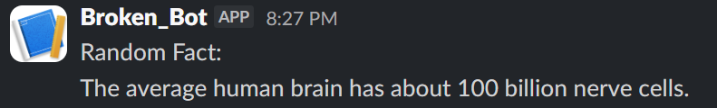

# BrokenBot

A simple Slack bot with slash commands for ping checks, cat facts, jokes, weather, and random facts.

## Try it (Quickstart)

Go to the bot-spam on slack, and type one of these commands:

/brokenbot-help  
/brokenbot-ping  
/brokenbot-catfact  
/brokenbot-joke  
/brokenbot-weather [city]  
/brokenbot-randomfact  

## Features

* `/brokenbot-ping` checks if the bot is online and shows latency.
* `/brokenbot-help` lists all available commands.
* `/brokenbot-catfact` fetches a random cat fact.
* `/brokenbot-joke` fetches a random joke.
* `/brokenbot-weather [city]` shows the current weather for a city.
* `/brokenbot-randomfact` fetches a random useless fact.

## How it works

BrokenBot is built with Node.js and Slack Bolt. It runs in Socket Mode, so it can receive Slack slash commands without needing a public request URL. The bot uses Axios to call small public APIs for facts, jokes, and weather data. The Bot is hostet on Nest.

## Setup locally

Clone the project and install dependencies:
npm install

Create a `.env` file in the project root:

Store your own keys in there.   

Run the bot: node index.js

When it starts successfully, you should see: bot is running!

In your Slack app settings, enable Socket Mode and create the slash commands. Make sure the app has the correct bot token scopes and is installed to your workspace.

## Credits

Built with the Stardance mission documentation.
